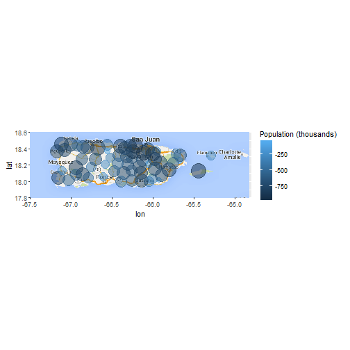

Population of Puerto Rican cities, 1899 to 2010
========================================================
author: Paul Bischoff
date: May 19, 2016

Project Overview
========================================================

This is an R Shiny app that leverages US Census data to overlay a map with points corresponding to Puerto Rican cities. The size and color of the points indicates the population of each city, with larger, darker points corresponding to higher populations. The user can select data from which year they wish to view from a dropdown menu, which will instantly reload the relevant map.

The data
========================================================

Historical data of the population of Puerto Rico by municipalities from 1899 to 2010. The information is organized in a cross-tabulation. Population censuses conducted by the US Department of War and the US Census Bureau. Based on data collected and published by the Graduate Program in Demography of the Medical Sciences Campus of the University of Puerto Rico. For the purposes of this project, the data is stored locally in two .csv files, but the original data can be downloaded from the links below:

Population data: https://datahub.io/dataset/poblacion-de-puerto-rico-1899-2010
Map cordinates for each city: https://datahub.io/dataset/coordenadas-geograficas-de-los-municipios-de-puerto-rico


Dependencies: server.R
================================================
Below are the libraries used by this app.

```r
library(shiny)
library(maptools)
library(ggmap)
```

Get and clean data: server.R
========================================================
First we import the data and merge the two data frames. Shiny code is commented out so it will run in this slideshow.

```r
#shinyServer(function(input, output) {
population <- read.csv("population.csv", header=TRUE, sep=",")
coordinates <- read.csv("coordinates.csv", header=TRUE, sep=",")
population$Poblacion <- as.numeric(population$Poblacion)
# put coordinates into population dataset
population$x_long <- coordinates$x_long[match(population$Municipio, coordinates$municipio)]
population$y_lat <- coordinates$y_lat[match(population$Municipio, coordinates$municipio)]
```

Get and clean data: server.R
=========================================================
After cleaning and merging the data, it looks like this:


```r
head(population)
```

```
  Municipio An.o Poblacion  x_long y_lat
1  Adjuntas 1899       371 -66.754 18.18
2  Adjuntas 1910       259 -66.754 18.18
3  Adjuntas 1920       299 -66.754 18.18
4  Adjuntas 1930       302 -66.754 18.18
5  Adjuntas 1935       372 -66.754 18.18
6  Adjuntas 1940       473 -66.754 18.18
```

Create map: server.R
=========================================================
Next we create the underlying map using get_map.

```r
#create map
mapimage <- get_map(location = c(long = -66.59, lat = 18.22), zoom = 8, source =           "google", maptype="roadmap")
```


Render the map: server.R
===================================================
Use the renderPlot function and ggmap to render the map and add points. For this slideshow, we've used a placeholder, 2010, instead of input$year.

```r
#output$map <- renderPlot({         
g <- ggmap(mapimage) +
      coord_fixed(xlim = c(-67.5, -64.8), ylim =c(17.8, 18.6)) +
      geom_point(data=population[population$An.o==2010,], #input$year
            aes(x = x_long, y = y_lat, size = Poblacion/969*10, 
            color = Poblacion*-1), alpha = .5) +
      labs(color="Population (thousands)") +
      scale_size(range = c(1, 10), guide='none')            
# })
#})
```

Render the map: server.R
===================================================
 


User interface: ui.R
========================================================
On the user interface, we create an input for the year. The dropdown menu allows us to limit users to years that censuses were taken, usually every 10 years.

```r
# Sidebar with an input for the year
#sidebarLayout(
#     sidebarPanel(
            selectInput("year","Year",c("1899"=1899,"1910"=1910,"1920"=1920,
                                        "1930"=1930,"1935"=1935,"1940"=1940,
                                        "1950"=1950,"1960"=1960,"1970"=1970,
                                        "1980"=1980,"1990"=1990,"2000"=2000,
                                        "2010"=2010))
```

<!--html_preserve--><div class="form-group shiny-input-container">
<label class="control-label" for="year">Year</label>
<div>
<select id="year"><option value="1899" selected>1899</option>
<option value="1910">1910</option>
<option value="1920">1920</option>
<option value="1930">1930</option>
<option value="1935">1935</option>
<option value="1940">1940</option>
<option value="1950">1950</option>
<option value="1960">1960</option>
<option value="1970">1970</option>
<option value="1980">1980</option>
<option value="1990">1990</option>
<option value="2000">2000</option>
<option value="2010">2010</option></select>
<script type="application/json" data-for="year" data-nonempty="">{}</script>
</div>
</div><!--/html_preserve-->

User Interface: ui.R
=================================================
And render the finished map.

```r
mainPanel(
                  plotOutput("map"),
      )
```
All the titles and text require no input from the user, so we've left out the code for that.

To try it yourself, find the live app [here](https://pabischoff.shinyapps.io/devdataprods/).

And the github repo [here](https://github.com/pabischoff/devdataprods).


